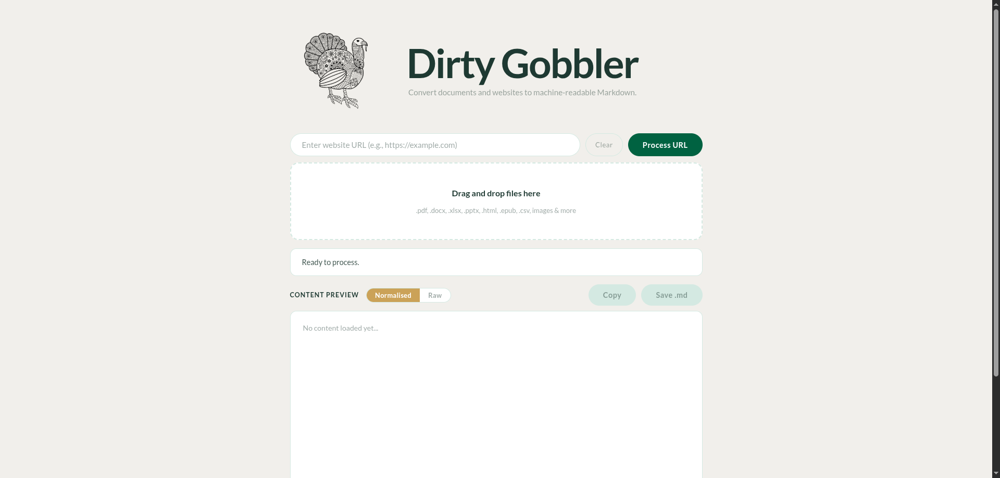

Thanks for your interest in this filthy little file. Greedy Gobbler is a small personal tool — designed to consume and crunch-up the vast steaming piles of human friendly media that clog our world into simple pelletised machine fodder.

DG will eat most things - even handwritten guff (within the limitations of Tesseract) but Video files are not supported. For video-to-text, try [Whisper](https://github.com/openai/whisper) (local, free) or upload directly to [Gemini](https://gemini.google.com) (cloud).



# Greedy Gobbler

Lightweight local desktop app that converts documents and websites into clean Markdown for LLM context windows.
No cloud. No headless browser. Everything runs on your machine.

Greedy Gobbler is a stripped-down variant of Gobbler (full version, not yet published) — single-page URL fetching only, with a much smaller dependency footprint.

## Supported input formats

| Format | Handler | Status |
|--------|---------|--------|
| PDF | MarkItDown (`pdfminer.six` + `pdfplumber`) | ✅ |
| DOCX | MarkItDown (`mammoth`) | ✅ |
| XLSX | MarkItDown (`openpyxl`) | ✅ |
| PPTX | MarkItDown (`python-pptx`) | ✅ |
| CSV | MarkItDown | ✅ |
| TXT | MarkItDown | ✅ |
| HTML | MarkItDown | ✅ |
| RTF | `striprtf` (custom path, bypasses MarkItDown) | ✅ |
| JPG / PNG | `pytesseract` OCR (custom path, bypasses MarkItDown) | ✅ |
| ODT | Not supported — no MarkItDown converter exists | ❌ |

**URLs:** Single-page fetch via `requests` + `markdownify`. No JavaScript rendering. No multi-page crawling.

## Features

- Drag-and-drop file upload
- Single-page URL fetch
- Markdown cleaning pipeline: strips navigation menus, cookie notices, boilerplate, and duplicate blocks
- Paywall detection: amber warning with HTML-save tip when content looks thin or gated
- Raw / Normalised toggle to compare output before and after cleaning
- Copy to clipboard or save as `.md` to `~/Downloads/GreedyGobbler/`
- Smart filename generation: `domain-slug.md` from URL structure

## Running with Docker (recommended)

Requires [Docker](https://docs.docker.com/get-docker/) installed.

```bash
git clone https://github.com/TidyWeb/GreedyGobbler.git
cd GreedyGobbler
docker compose up --build
```

Then open http://localhost:5001 in your browser. Converted files are saved to `./output/` in the project folder.

## Running without Docker

```bash
cd GreedyGobbler
source .venv/bin/activate
python app.py
```

Then open [http://127.0.0.1:5001](http://127.0.0.1:5001) in your browser.

## Project structure

```
app.py              Flask server (routes: /, /process, /download)
converter.py        Orchestration: custom RTF + OCR paths, MarkItDown for everything else, requests for URLs
pipeline/
  normaliser.py     Deterministic Markdown cleaning pipeline
static/
  index.html        UI
  app.js            Frontend logic
launch.sh           Launcher script
requirements.txt    All direct dependencies
```

## Dependencies

| Package | Purpose |
|---------|---------|
| Flask | Web server |
| `markitdown[pdf,docx,xlsx,pptx]` | File-to-Markdown conversion |
| `pytesseract` + `Pillow` | OCR for JPG / PNG |
| `striprtf` | RTF extraction |
| `requests` + `beautifulsoup4` + `markdownify` | URL fetching |
