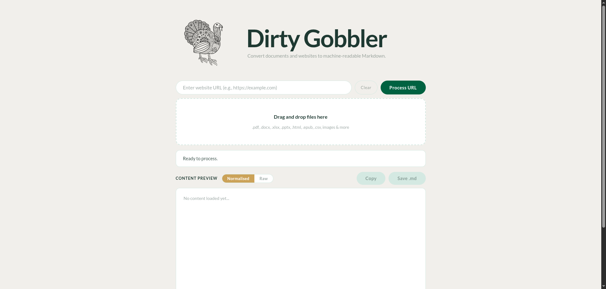

Thanks for your interest in this filthy little file. Greedy Gobbler is a small personal tool designed to consume and crunch up human-friendly media into simple machine-readable Markdown.

Greedy Gobbler will eat most text-heavy things, including OCR for images and PDFs within the limits of Tesseract. Video files are not supported. For video-to-text, try [Whisper](https://github.com/openai/whisper) locally or upload directly to [Gemini](https://gemini.google.com).



# Greedy Gobbler

Local desktop app that converts documents, ebooks, PDFs, images, and websites into clean Markdown for LLM context windows.
No cloud is required for local files. URL extraction can use local crawling and Microlink fallback.

## Supported input formats

| Format | Handler | Status |
|--------|---------|--------|
| PDF | `pdfplumber`, MarkItDown fallback, image OCR fallback | Supported |
| EPUB | `EbookLib` body extraction | Supported |
| MOBI / AZW / FB2 / LRF / HTMLZ | Calibre `ebook-convert`, when installed | Supported when Calibre is installed |
| DjVu | `djvutxt`, when installed | Supported when DjVu tools are installed |
| DOCX / XLSX / PPTX / CSV / TXT / HTML | MarkItDown | Supported |
| JPG / JPEG / PNG | `pytesseract` OCR | Supported |
| Video | Not supported | Not supported |

**URLs:** single-page extraction uses Microlink first, then Crawl4AI fallback. Depth 2 crawling stays on the same domain and is capped at 25 pages.

## Features

- Drag-and-drop file upload
- URL crawling with configurable depth
- Markdown cleaning pipeline for navigation, cookie notices, boilerplate, Reddit chrome, duplicated blocks, and site UI clutter
- Front/back matter trimming for EPUB and PDF body extraction
- Raw / Normalised toggle to compare output before and after cleaning
- Editable output preview before copy/save
- Copy to clipboard or save as `.md` to `~/Downloads/GreedyGobbler/`
- Smart filename generation from URL structure

## Running with Docker

Requires [Docker](https://docs.docker.com/get-docker/) installed.

```bash
git clone https://github.com/TidyWeb/GreedyGobbler.git
cd GreedyGobbler
docker compose up --build
```

Then open http://localhost:5001 in your browser. Converted files are saved to `./output/` in the project folder.

## Running without Docker

```bash
cd GreedyGobbler
source .venv/bin/activate
python app.py
```

Then open [http://127.0.0.1:5001](http://127.0.0.1:5001) in your browser.

## Project structure

```text
app.py              Flask server (routes: /, /process, /download, /progress)
converter.py        Orchestration for URLs, files, ebooks, PDF extraction, and OCR
pipeline/
  normaliser.py     Deterministic Markdown cleaning pipeline
static/
  index.html        UI
  app.js            Frontend logic
launch.sh           Launcher script
requirements.txt    Python dependencies
```

## Dependencies

| Package | Purpose |
|---------|---------|
| Flask | Web server |
| MarkItDown | General file-to-Markdown conversion |
| Crawl4AI | URL crawling and Markdown extraction |
| `pdfplumber` + `pdf2image` | PDF text extraction and OCR fallback |
| `EbookLib` + BeautifulSoup | EPUB body extraction |
| `pytesseract` + Pillow | OCR for images and scanned PDFs |
| Calibre `ebook-convert` | Optional conversion for MOBI/AZW/FB2/LRF/HTMLZ |
| DjVu tools | Optional text extraction for DjVu files |
